### Project Title
Seek&Sport - A website application that allows for users to find nearby parks within their area and finding people to play sports with.
Users can book, join and leave events.
Also once within an event, can join the chat room to talk with the other particiapnts!

### Getting Started
These instructions will get you a copy of the project up and running on your local machine for development and testing purposes.

Go to the server directory. Run npm install/yarn install followed by npm start/yarn start. The server will be running on port 4000

Go to the client directory. Run npm install/yarn install followed by npm start/yarn start. Accept to listen to FE on port 3000

### Flow for user.
## SignUp/Login
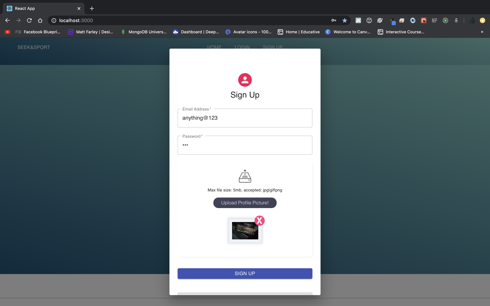

## Home
### Chat Bot welcomes. New options on navigation menu. 
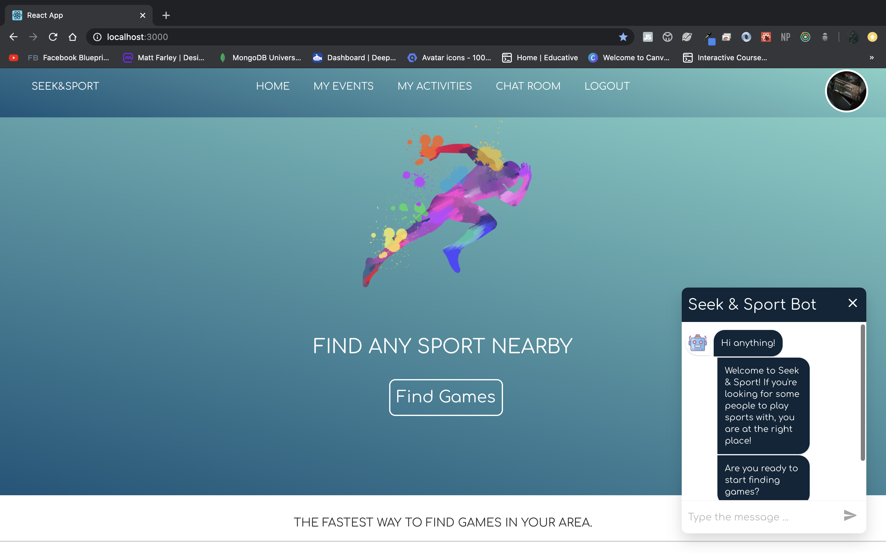

## Find Games
### Type an address to find parks nearby.
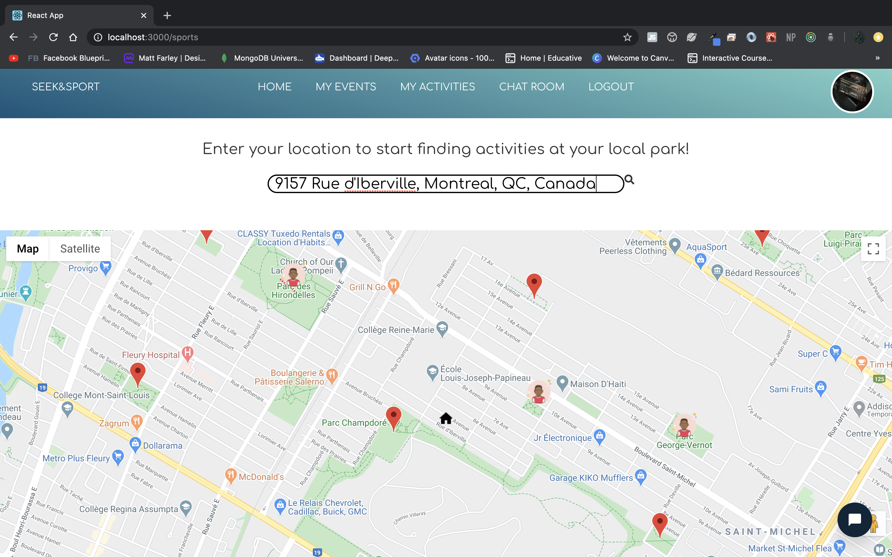

## Select a park.
### Click on a park and either HOST or VIEW an activity.
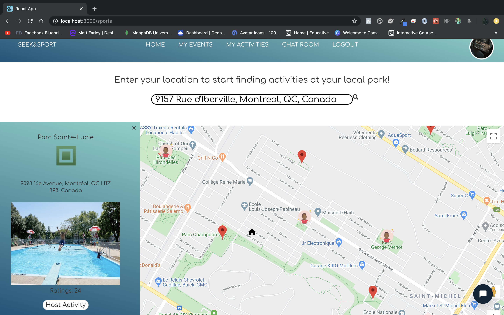

## Host a sport activity at the selected park..
### Book a activity during a valid time frame.
### Also Hosts have the option to cancel the event.
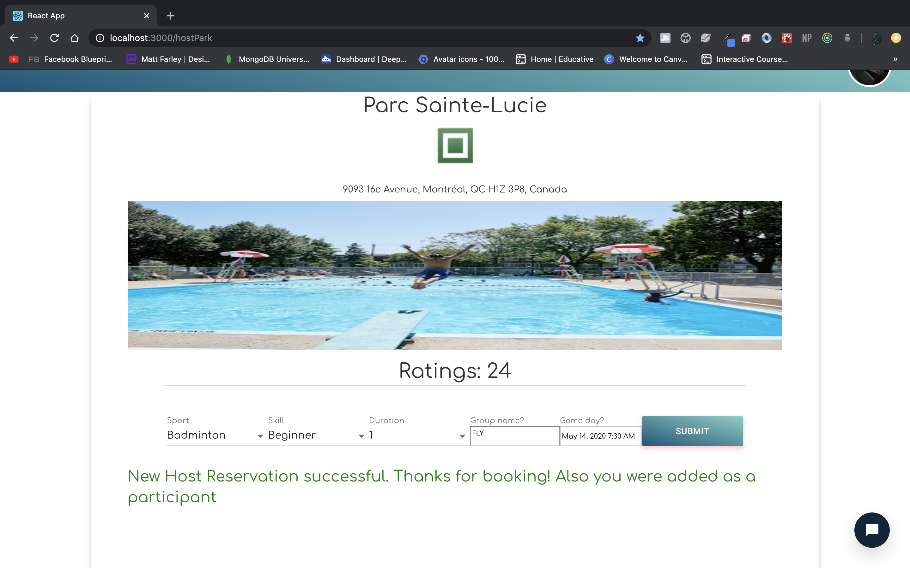

## Time Conflict at the same park.
### A host cannot re-book at the same park that conflicts with another event that he/she is hosting.
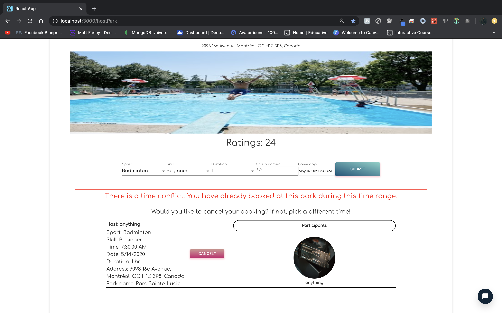

## Time Conflict at the a different park.
### A host cannot book at a different park that conflicts with another event that he/she is hosting during the same time range.
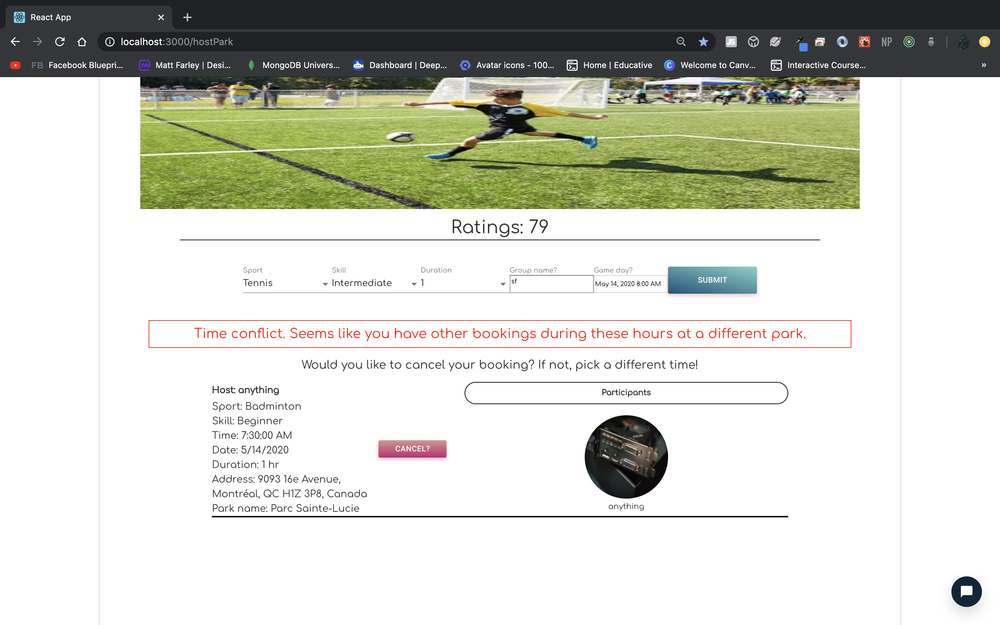

## Marker to show booking.
### Once booking is completed. Researching the address and finding the same park, now the it will show a marker with an avatar showing that there is an event being held in that park.
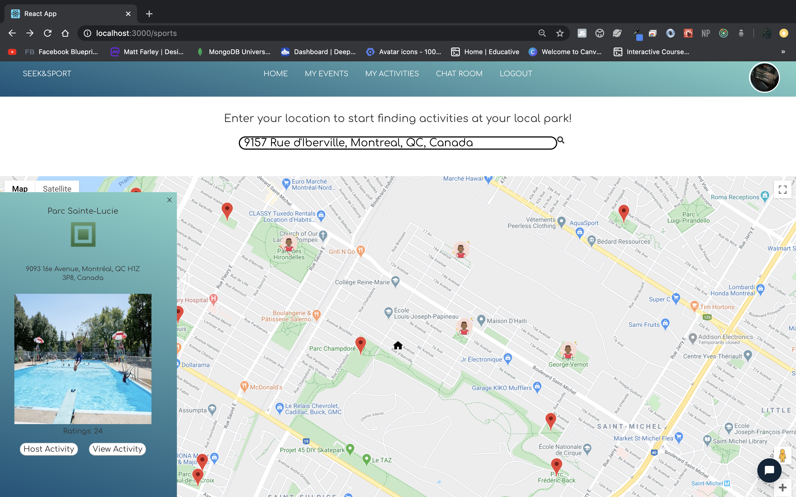

## Different User - Join/Leave
### Now a different logged in user can find the same event at the park and can has the option to join or leave the event.
### Users that that are hosting events only have the option to cancel, where users not hosting have the option to join or leave
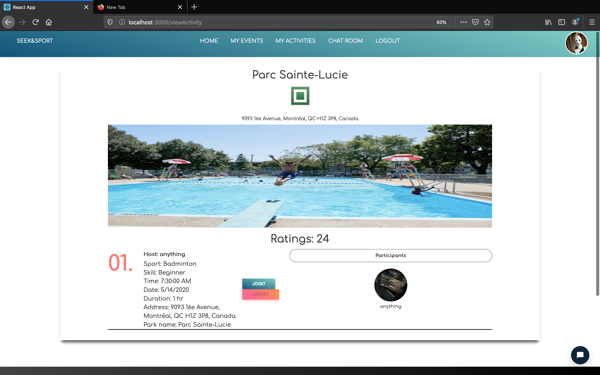
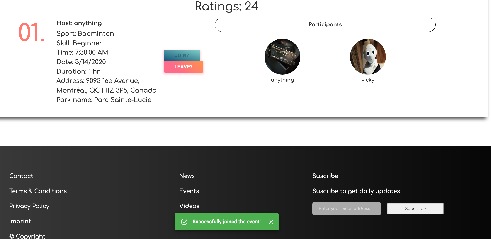

## My Events / My Activities
### At the top of the navigation menu. Users can view the events that they are hosting/participating in.
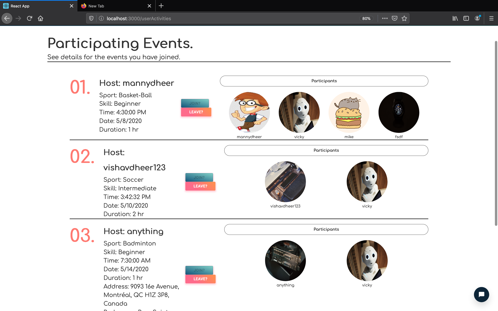

## ChatRoom
### Once 1 or more members have joined an event. They can navigate to the ChatRoom and talk to others that are participating in the same event. Hovering over the room names shows the location of the park!
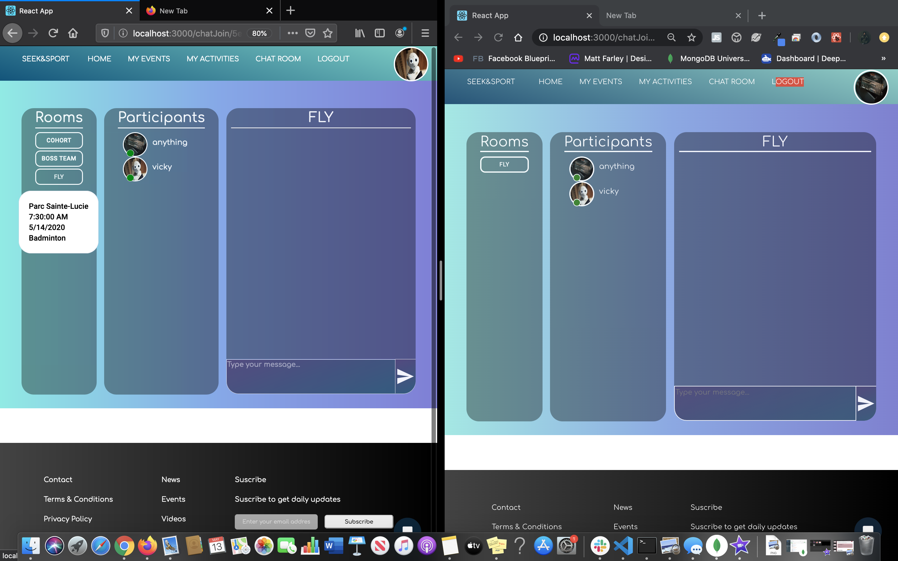

## Chatting - Online/Offline
### Only participating users can talk to each other. 

### Also, users can see who is online/offline within a chat room.
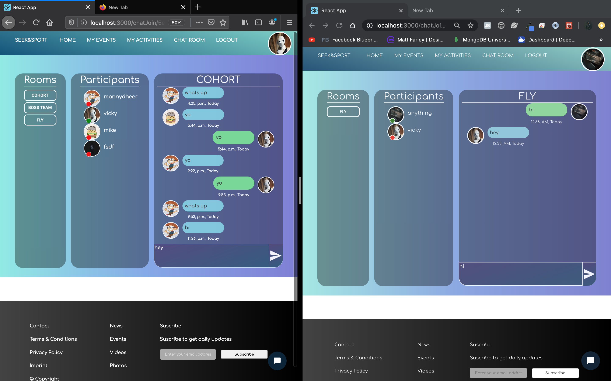

## Link to demo.

### Prerequisites
- Mongodb
-node.js, npm/yarn

### Built With
MongoDb - For database.
Node.js - Backend
React - FrontEnd

### Authors
Manider Dheer.

### License
This project is licensed under the MIT License - see the LICENSE.md file for details

### Acknowledgments
Big thank you to LucasBassetti - ReactSimpleChatbot
Materials UI!
